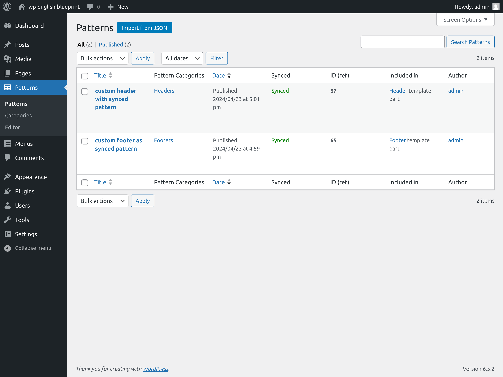
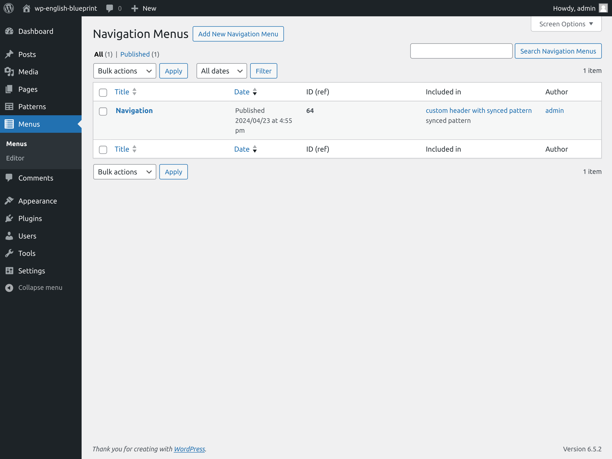

# Simply add hidden menu items

Adds the patterns and menus items in the WordPress administration menu with some useful columns to the patterns and menus pages, and improves the import process of the WordPress Importer plugin.

== Description ==

Adds the patterns and menus items in the WordPress administration menu with some useful columns to the patterns and menus pages, and improves the import process of the WordPress Importer plugin, so that when synced patterns or menus are imported with a different id than the original XML file has, content is replaced with references to the new ids.

## Example of usage

To test this plugin, you may use a demo site with the Twentytwentyfour theme activated, for instante.

1. Activate the sahmi plugin and go to the patterns section of the site editor.
2. Edit the Header template part and create a synced pattern from the group block that groups all the blocks included in the header.
3. Repeat the same thing with the Footer template part.
4. Go to the patterns & menus items that you will seen bellow the comments menu item and you will find your two recently crated synced patterns.
5. Now, managing the footer and header content is easier, just edit the synced pattern. An you will be able to acces all your customizations from the main admin menu. Use patterns and menus are a very important part of users content and they deserve a menu item to access them directly as any other piece of content (media, posts, pages, comments, ...)
6. Feel free to move your customized content to another site with the import / export tool, the referencial integrity of synced patterns and menus will not be lostlost if you either delete first all the content of the destination site or you use the sahmin plugin.

== Changelog ==

= 1.0.0 =
* Initial vesion released
